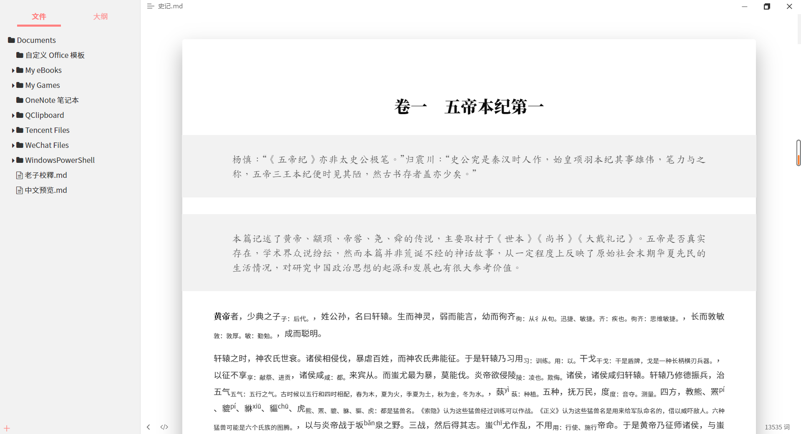
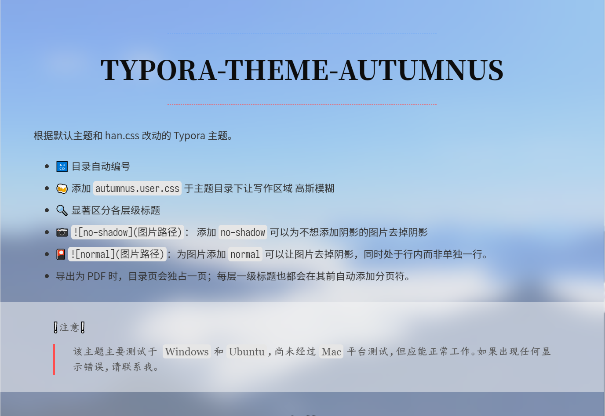
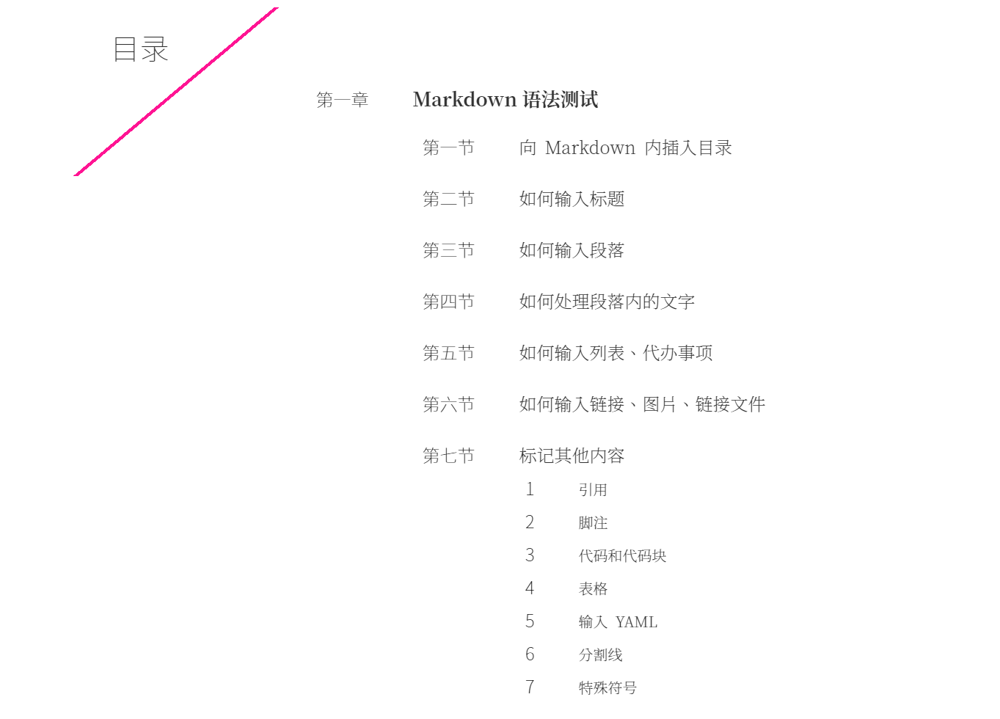
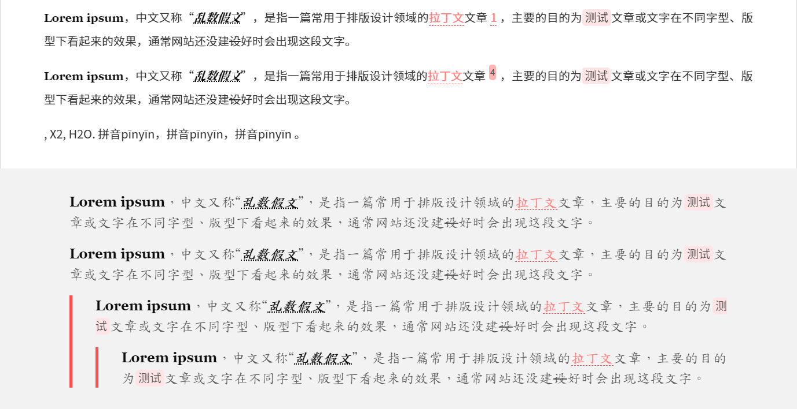
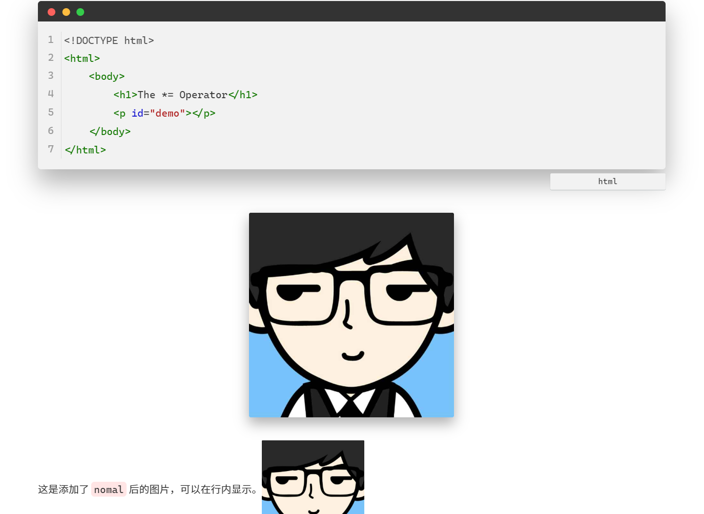
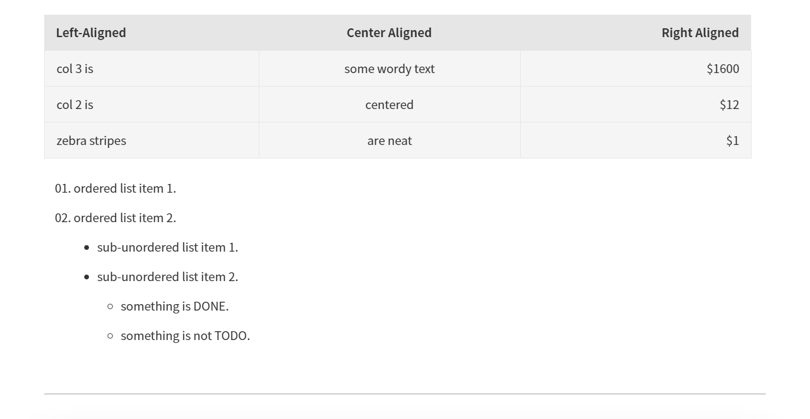

# typora-theme-autumnus

根据默认主题和 han.css 改动的 Typora 主题。

+ 🔠 目录自动编号
+ 🍻 添加 `autumnus.user.css` 于主题目录下让写作区域 高斯模糊
+ 🔍 显著区分各层级标题
+ 📷 ``： 添加 `no-shadow` 可以为不想添加阴影的图片去掉阴影
+ 🎴 ``：为图片添加 `normal` 可以让图片去掉阴影，同时处于行内而非单独一行。
+ 📖导出为 PDF 时，可以添加 `
` 来添加分页符。

> ❕注意❕
>
> > 该主题主要测试于  `Windows` 和 `Ubuntu`，尚未经过 `Mac` 平台测试，但应能正常工作。如果出现任何显示错误，请联系我。

## 安装

>  建议安装的字体：思源黑体、思源宋体、更纱黑体（term sc），苍耳今楷05。
>
>  可选字体：Cascadia code、全字库楷体

> 字体安装（没有区分 Noto 字体和 Sans Hans 字体）：
>
> 思源黑体（简体中文）：[Google官网](https://www.google.cn/get/noto/#sans-hans)、[Adobe官网](https://fonts.adobe.com/fonts/source-han-sans-simplified-chinese)、[Github](https://github.com/googlefonts/noto-cjk)
>
> 思源宋体（简体中文）：[Google官网](https://www.google.cn/get/noto/#serif-hans)、[Adobe官网](https://fonts.adobe.com/fonts/source-han-serif-simplified-chinese)、[Github](https://github.com/googlefonts/noto-cjk)
>
> 更纱黑体（只需要安装 Sarasa Term SC 即可）：[Github](https://github.com/be5invis/Sarasa-Gothic/releases/tag/v0.12.14)、[清华大学镜像下载站](https://mirrors.tuna.tsinghua.edu.cn/github-release/be5invis/Sarasa-Gothic/v0.12.14/)

下载该主题后，将主题的 `autumnus.css` 文件和 `fluent` 文件夹置于 `C:\Users\{UserName}\AppData\Roaming\Typora\themes` 目录下，重启 Typora 即可在主题选项下启用该主题。若要启用 `fluent` 将 `autumnus.user.css` 一同置于目录下即可启用。

## 更新日志

2020-09-07——`UPDATE`

+ 再次调整了 PDF 的导出样式。
+ 目录只保留到三级，四级到六级标题不再显示。
+ 调整了导出为 HTML 时的样式。
+ 其他样式的微调。

2020-09-04——`UPDATE`

+ 优化了 PDF 导出时的样式（目录，TODO，引用，正文字体）。
+ 导出为 PDF 时，可通过添加 横线 来自定分页的位置，不在强制让目录和标题一分页。
+ 修改了目录样式。

2020-09-03——`UPDATE`

+ 调整了代办事项样式。
+ 调整了代码块样式(仿macOS)。
+ 调整了标题和内容的距离。
+ 修复了部分错误。

2020-08-19——`UPDATE`

+ 调整了部分样式（链接、图片）。
+ 添加图片时，可选去掉阴影。（例：）
+ 为部分元素添加点击动画。（表格、按钮）
+ 将 引用 字体正式替换为 **楷体**。（在样式表内注释掉相关代码可替换回宋体或者黑体）

2020-08-17——`UPDATE`

+ 调整了导出格式的样式，包括 `PDF`、`HTML`。
+ 调整了在较小宽度下的显示样式。
+ 取出 `fluent` 样式，在使用时，将 `autumnus.user.css` 置于主题目录下即可。此时的 `fluent` 做为 `autumnus` 的补丁存在。

2020-08-16——`UPDATE`

+ 对脚注样式进行了更改。
+ 合并了 `fluent` 样式。（取消相应的代码即可启用）
+ 对行内代码样式进行微调。
+ 对目录样式进行微调。
+ 将主要高亮颜色替换回红色[hsl(0,100%,65%)]。
+ 修复了页脚的显示错误。调整了 `fluent` 样式下的显示色。
+ 对代码块的样式进行了微调。
+ 调整了专注模式下的非专注行的字体颜色。
+ 调整了图片的阴影显示。使之不在小图片的情况下，阴影过大。

2020-08-15—— `UPDATE`  

+ 更新了缺省字体中的楷体（未启用，全局样式名为 `--quota-font`）。
+ 调整了部分元素颜色、间距。
+ 增加了目录自动编码，默认只显示到四级标题。（将代码 `.md-toc-h5,.md-toc-h6 {display: none;}` 注释掉即可）。
+ 增加了大纲目录自动编码。
+ 三到六级标题的区分更加明显。
+ 调整了图片的样式。

2020-08-12 —— `UPDATE`  

+ 添加了更多的缺省字体，参考 `font.css`。
+ 修改了引用的显示样式和打印样式。
+ 修改了 UI 界面部分的颜色配合问题。
+ 修改了表格样式，使之更加明显。
+ 修复了部分显示错误。

`已知问题`：

- [x] 在引用中，光标显示会滞后一格（删除了引用首字下沉导致的光标异常）。
- [x] 在选中一段长文字后，尤其是当前文字超过一段，选中背景色会在行末存续 1s 左右。
- [ ] 若启用 `fluent` 样式，当开启和关闭文件侧边栏、开启和关闭源代码模式时，侧边栏出现短暂的黑边。

`待完成部分`：

- [x] 目录样式优化。
- [x] 黑夜模式（已创建，[typora-theme-autumnus_dark](https://github.com/Soanguy/typora-theme-autumnus_dark)）。
- [x] 修改目录样式。
- [x] 优化 PDF 导出样式。

## 样式预览

附：样式修改参考

