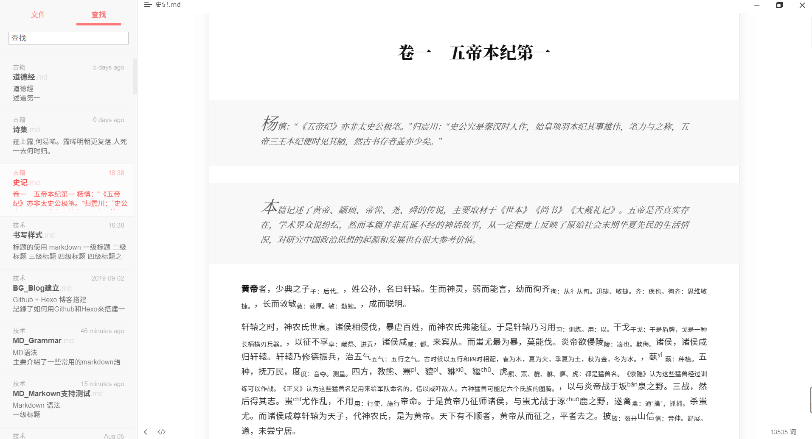
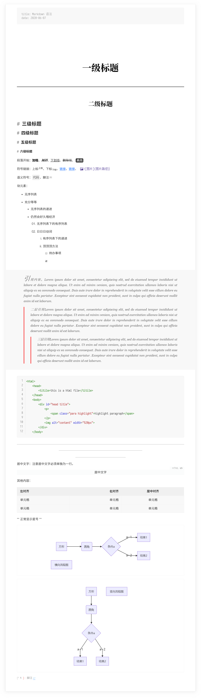
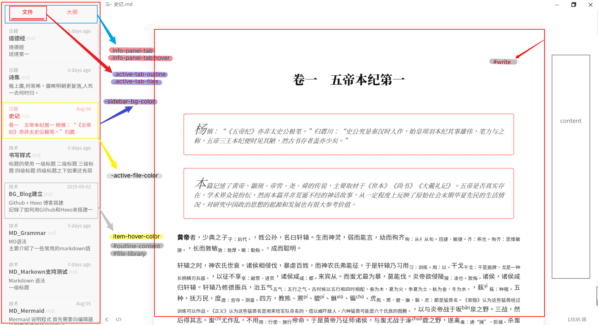
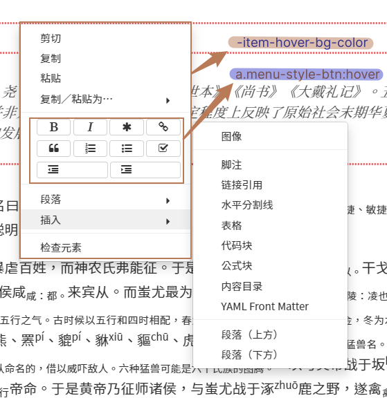
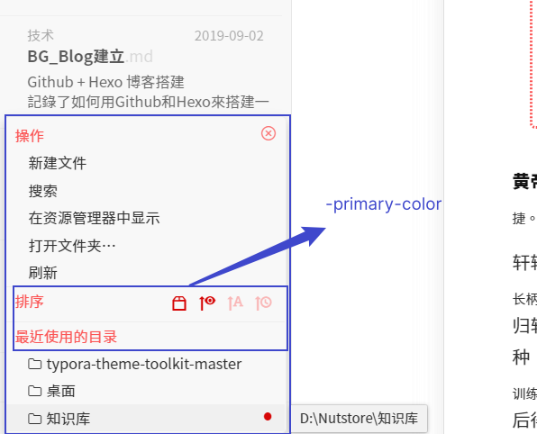
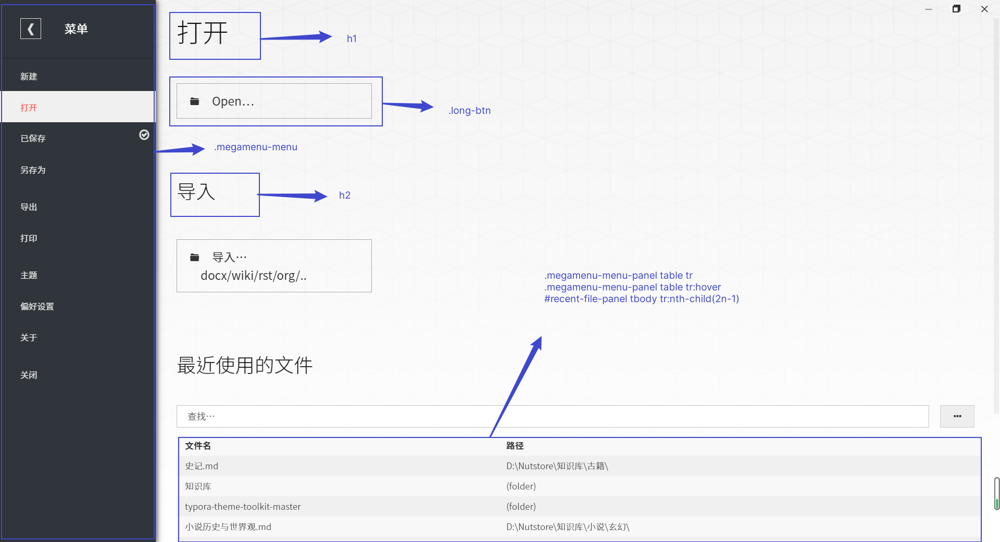

# typora-theme-autumnus

根据默认主题和 han.css 改动的 Typora 主题。

> ❕注意❕
>
> > 该主题主要测试于  `Windows` 和 `Ubuntu`，尚未经过 `Mac` 平台测试，但应能正常工作。如果出现任何显示错误，请联系我。

## 安装

>  建议安装的字体：思源黑体、思源宋体、更纱黑体（term sc），苍耳今楷05。

下载该主题后，将主题的 `autumnus.css` 文件和 `fluent` 文件夹置于 `C:\Users\{UserName}\AppData\Roaming\Typora\themes` 目录下，重启 Typora 即可在主题选项下启用该主题。若要启用 `fluent` 将 `autumnus.user.css` 一同置于目录下即可启用。

## 推荐配色

rgb(235,235,235)

#fffafa

rgb(45,36,31)

hsl(0,0%,5%)

hsl(0,0%,20%)

hsl(0,0%,35%)

hsl(0,0%,50%)

hsl(0,0%,75%)

hsl(0,0%,80%)

hsl(0,0%,90%)

hsl(0,0%,95%)

hsl(0,0%,98%)

hsl(0,0%,99%)

hsl(0,0%,100%)

hsl(0,100%,65%)

hsl(0,100%,75%)

hsl(215,100%,65%)

hsl(215,100%,75%)

hsl(70, 100%, 65%)

hsl(70, 100%, 75%)

## 更新日志

2020-08-17——`UPDATE`

+ 调整了导出格式的样式，包括 `PDF`、`HTML`。样式预览：[HTML 格式预览](./typora-theme-review/lorem-ipsum.html)、[PDF 格式预览](./typora-theme-review/lorem-ipsum.pdf)、[fluent 样式的 HTML 格式预览](./typora-theme-review/lorem-ipsum-fluent.html)。
+ 调整了在较小宽度下的显示样式。
+ 取出 `fluent` 样式，在使用时，将 `autumnus.user.css` 置于主题目录下即可。此时的 `fluent` 做为 `autumnus` 的补丁存在。

2020-08-16——`UPDATE`

+ 对脚注样式进行了更改。
+ 合并了 `fluent` 样式。（取消相应的代码即可启用）
+ 对行内代码样式进行微调。
+ 对目录样式进行微调。
+ 将主要高亮颜色替换回红色[hsl(0,100%,65%)]。
+ 修复了页脚的显示错误。调整了 `fluent` 样式下的显示色。
+ 对代码块的样式进行了微调。
+ 调整了专注模式下的非专注行的字体颜色。
+ 调整了图片的阴影显示。使之不在小图片的情况下，阴影过大。

2020-08-15—— `UPDATE`  

+ 更新了缺省字体中的楷体（未启用，全局样式名为 `--quota-font`）。
+ 调整了部分元素颜色、间距。
+ 增加了目录自动编码，默认只显示到四级标题。（将代码 `.md-toc-h5,.md-toc-h6 {display: none;}` 注释掉即可）。
+ 增加了大纲目录自动编码。
+ 三到六级标题的区分更加明显。
+ 调整了图片的样式。

2020-08-12 —— `UPDATE`  

+ 添加了更多的缺省字体，参考 `font.css`。
+ 修改了引用的显示样式和打印样式。
+ 修改了 UI 界面部分的颜色配合问题。
+ 修改了表格样式，使之更加明显。
+ 修复了部分显示错误。

`已知问题`：

- [x] 在引用中，光标显示会滞后一格（删除了引用首字下沉导致的光标异常）。
- [x] 在选中一段长文字后，尤其是当前文字超过一段，选中背景色会在行末存续 1s 左右。
- [ ] 若启用 `fluent` 样式，当开启和关闭文件侧边栏、开启和关闭源代码模式时，侧边栏出现短暂的黑边。

`待完成部分`：

- [x] 目录样式优化。
- [x] 黑夜模式（已创建，[typora-theme-autumnus_dark](https://github.com/Soanguy/typora-theme-autumnus_dark)）

## 样式预览

附：样式修改参考

